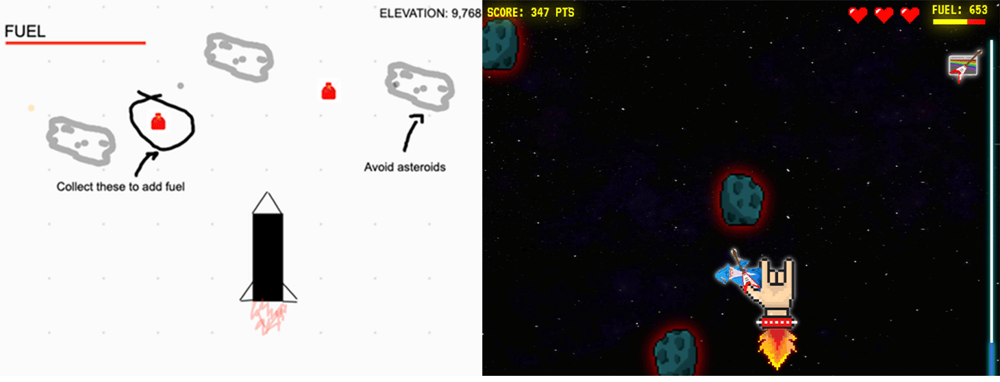
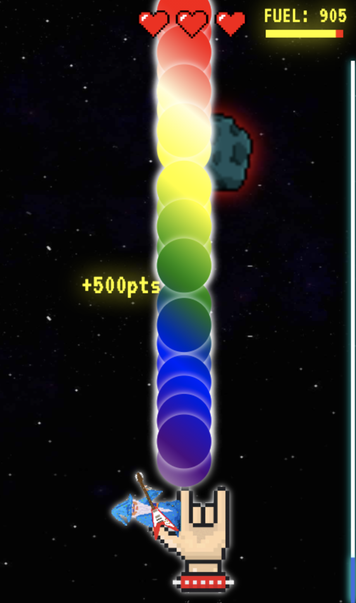

# Rocket-Sauce

## Overview

Here lies my first original web-game project: ROCKET SAUCE! I wanted to spend most of my time having fun with the creative side of the project, so I chose a game concept that I knew I could get up and running fairly quick. As you can see in the original mock-up, the concept is quite simple: fly the rocket as high as you can, avoid asteroids, and collect fuel along the way to keep going. This project hit that "goldie-locks" level of not too difficult, but also just enough of a challenge for me to learn new things. Most importantly, I got to have a lot of fun with this.

---

### Mock-up vs. Finished Look



## How to play

- Click the link! --> <a href="https://tcgilbert.github.io/rocket-sauce/">Rocket Sauce - PLAY NOW</a>

## Languages and Tools

- Vanilla Javascript
- HTML5 Canvas
- CSS
- Adobe Photoshop

---

## How the code operates

Essentially, this project was an excerise in Object Oriented Programming. The objects in this case are as follows:

- The rocket: [rocket.js](./js/rocket.js)
- The asteroids: [asteroid.js](./js/asteroid.js)
- The fuel: [fuel.js](./js/fuel.js)
- The particle blaster: [particle.js](./js/particle.js)

Apart from that, [main.js](./js/main.js) dictates how these objects interact with each other, and establishes a game loop. 

```js
// game loop
function animate() {
  ctx.clearRect(0, 0, canvas.width, canvas.height);
  handleBackground();
  updateParameters();
  rocket.update();
  rocket.draw();
  handleAsteroids();
  handleFuel();
  if (gameStarted) handleBlaster();
  if (gameStarted) collisionDetection();
  if (gameStarted) frame++;
  if (gameStarted) gameOverMan();
  playerInfo();
  handleAudio();
  requestAnimationFrame(animate);
}

// start or end game
canvas.addEventListener("click", function (e) {
  if (gameOver) init();
  if (!gameInit) {
    gameInit = true;
    animate();
  }
});

```

## Key Elements

## 1.) The illusion of upward movement

- The reality of this game is simply a square box moving from side to side in an HTML canvas. That being the case, it was really important to create a feeling of upward mobility.
- This was accomplished in two ways
  1. Scrolling background
  2. Oscillating rocket object

### Scrolling Background

- There are two conditions in my handle background function

  - The first condition handles the first three background images, while the second condition handles the repeated background when the rocket is "in space."
  - The repeat is accomplished by drawing two images at the same time: one hidden and one the user sees. Once the visible image leaves the canvas its `y coordinate` is set to image's negative height value.

    - `repeatBG.y1 = -repeatBG.height;`

```javascript
function handleBackground() {
  // draw the first three images to illustrate the rocket leaving earth's atmosphere
  if (yPosR === 0) {
    yPos += bgScroll * 0.5;
    ctx.drawImage(launchStage, 0, yPos, canvas.width, canvas.height);
    ctx.drawImage(stage2, 0, yPos - 800, canvas.width, canvas.height);
    ctx.drawImage(stars, 0, yPos - 1600, canvas.width, canvas.height);
  }
  // Once in orbit (after 1600 pixels of upward movement), simply show space backgrounds
  if (yPos > 1600) {
    if (repeatBG.y1 >= repeatBG.height) repeatBG.y1 = -repeatBG.height;
    else repeatBG.y1 += bgScroll * 0.5;
    if (repeatBG.y2 >= repeatBG.height) repeatBG.y2 = -repeatBG.height;
    else repeatBG.y2 += bgScroll * 0.5;
    ctx.drawImage(stars, 0, repeatBG.y1, canvas.width, canvas.height);
    ctx.drawImage(stars, 0, repeatBG.y2, canvas.width, canvas.height);
  }
}
```

---

## 2.) Asteroids and Fuel

- In order to make sure the objects in the game where operating optimally, I had to do a lot of experimenting before I felt like the game actually was engaging.
- To accomplish this, not only did the objects need different spawn rates, but also, the rate at which objects appeared had to vary based on your progress within the game.

### Spawn Locations

- Every obstacle spawned is created above the canvas, and each object has a unique downward velocity depending on its type. All this function does is return a random `x position` whenever an object is created, dictating an even distribution of objects throughout the game.
- Because the canvas is 1000px wide I choose to create 10 different spawn locations to cover the whole canvas.

```javascript
function randomStartPos() {
  // generate random number 1 - 10, return x position of object
  let ranNum = Math.ceil(Math.random() * 10);
  switch (ranNum) {
    case 1:
      return 100;
    case 2:
      return 200;
    case 3:
      return 300;
    case 4:
      return 400;
    case 5:
      return 500;
    case 6:
      return 600;
    case 7:
      return 700;
    case 8:
      return 800;
    case 9:
      return 900;
    case 10:
      return 950;
  }
}
```

### Spawn Rates

- The rate at which objects appeared was determined in their respective handler functions. All object handlers make use of the `frame` variable. The `frame` variable is essentially an integer that starts at zero and increments every time the game loop function is called. 
- The rate at which fuel objects are spawned stays constant throughout the game.

```javascript
function handleFuel() {
  // clear all fuel objects when restarting the game
  if (!gameStarted) {
    for (let i = 0; i < fuelArray.length; i++) {
      fuelArray.pop();
    }
  }
  // once in "orbit", start generating fuel objects
  if (elevation > 210) {
    // fuelRate equals 200, so every 200 frames spawn a fuel object
    if (frame % fuelRate === 0) {
      fuelArray.unshift(new Fuel());
    }
    // give provided objects functionality
    for (let i = 0; i < fuelArray.length; i++) {
      fuelArray[i].update();
    }
    // ensure they are never more then 5 fuel objects in the queue
    if (fuelArray.length > 5) {
      fuelArray.pop(fuelArray[0]);
    }
  }
}
```

- `handleAsteroids()`
  - Because I wanted the rate at which asteroids are generated to be dynamic, I had to take a different approach that allowed for more control in how and when the asteroids are spawned.
  - I tried a few different approaches, but eventually I settled on creating a `setInterval()` function that allowed me to increase the rate at which asteroids are generated as the game goes on.

```javascript
function handleAsteroids() {
  // every 1000 game frames, increase asteroid speed
  if ((frame + 1) % 1000 === 0) {
    if (asteroidSpeed < 15) asteroidSpeed++;
    asteroidRate += 0.05;
  }
  // clear all asteroids when restarting game
  if (!gameStarted) {
    for (let i = 0; i < asteroidArray.length; i++) {
      asteroidArray.pop();
    }
    for (let i = 0; i < bigAsteroidArray.length; i++) {
      bigAsteroidArray.pop();
    }
  }
  // elevation increases when the up arrow key is pressed, once we hit 100 hundred, start spawning big asteroids
  if (elevation > 100) {
    // different and less frequent interval for Big Asteroids 
    if (!intervalStarted2) {
      // spawn big asteroid at dynamic rate that changes throughout game
      bigAsteroidInterval = setInterval(spawnAsteroidBig, bigAsteroidRate);
      intervalStarted2 = true;
    }
    for (let i = 0; i < bigAsteroidArray.length; i++) {
      bigAsteroidArray[i].update();
    }
    // limit to only 4 big asteroids at all times
    if (bigAsteroidArray.length > 4) {
      bigAsteroidArray.pop(bigAsteroidArray[0]);
    }

    // small asteroids
    if (!intervalStarted) {
      smallAsteroidInterval = setInterval(
        // spawns asteroid
        spawnAsteroidSmall,
        // dynamic rate that changes throughout game
        smallAsteroidRate
      );
      intervalStarted = true;
    }
    for (let i = 0; i < asteroidArray.length; i++) {
      asteroidArray[i].update();
    }
    // limit to only 5 small asteroids at all times
    if (asteroidArray.length > 5) {
      asteroidArray.pop(asteroidArray[0]);
    }
  }
}
```

---

## 3.) The power-up blaster

<div>

</div>

- While not the prettiest particle animation you'll see, I am proud of the way this came out. The particles are generated in the same way as the fuel objects, just at a much faster rate.

```js
function handleBlaster() {
  // when the space bar is pressed, initiate blaster. Every 2 game frames generate a particle
  if (blast) {
    if (frame % 2 === 0) {
      blasterArray.push(new Particle(350, rocket.y - 20));
    }
    for (let i = 0; i < blasterArray.length; i++) {
      blasterArray[i].update();
    }
    // limit particles to 50 at a time
    if (blasterArray.length > 50) blasterArray.pop();
  } else {
    // clear particles after power up time has elapsed
    for (let i = 0; i < blasterArray.length; i++) {
      blasterArray.pop();
    }
  }
}
```

- Upon collision with an asteroid, the `blasted` property of the asteroid is set to true which changes the draw method of the asteroid class to draw `"+Xpts"`, as well as turn off collision detection for that object.

```js
class Asteroid {
  constructor() {
    this.x = randomStartPos();
    this.y = -20;
    this.width = 60;
    this.blasted = false;
    this.image = randomImg();
  }
  draw() {
    // draw normal asteroid on canvas
    if (!this.blasted) {
      ctx.save();
      ctx.shadowBlur = 30;
      ctx.shadowColor = "red";
      ctx.drawImage(
        this.image,
        this.x - 40,
        this.y - 20,
        this.width * 2,
        this.width * 2
      );
      ctx.restore();
    // draw points on canvas if asteroid is hit by particle blaster
    } else {
      ctx.save();
      ctx.font = "37px VT323";
      ctx.fillStyle = "yellow";
      ctx.shadowBlur = 30;
      ctx.shadowColor = "yellow";
      ctx.fillText(`+500pts`, this.x - 40, this.y - 20);
      ctx.restore();
    }
  }
```
