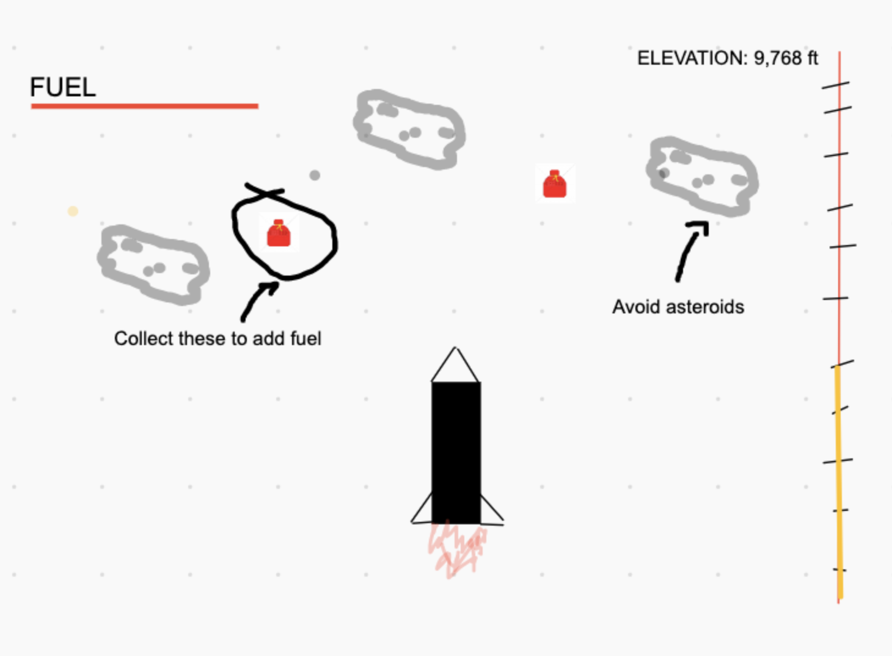
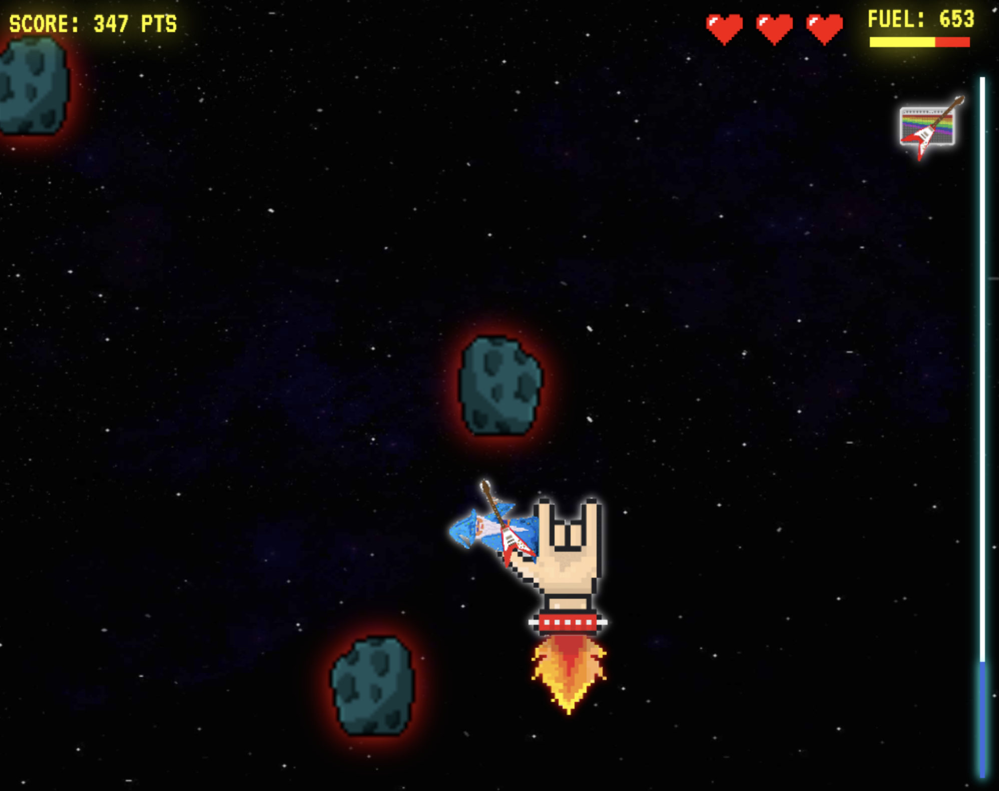

# Rocket-Sauce: the game

## Overview
Here lies my very first web-game project that was completely of my own making. I wanted to create a game that hit that "goldie locks" level of not too diffcult, but also still an appropriate challenge. I am happy to report this game provided just that. As you can see by looking at the initial sketch, the concept is quite simple: Fly a rocket as high as you can, avoid asteroids along the way, and collect fuel to keep going. 
___
### Original Mock-up: where I started...

### Completed Project: where I ended up...


## Key Elements
___
## 1.) The illusion of upward movement
- Because the meat of this game is a square box moving from side to side on the lower fourth of the canvas, it was really important to create a feeling of upward mobility
- This was accomplished in two ways
    1. Scrolling background
    2. Oscillating upper limit on rocket
### Scrolling Background
- There are two conditions in my handle background function
    - The first condition handles the first three background images, while the second condition handles the repeated background when the rocket is "in space."
    - The repeat is accomplished by drawing two images at the same time: one hidden and one the user sees. Once the visible image leaves the canvas its `y coordinate` is set to image's negative height value 
    
        - `repeatBG.y1 = -repeatBG.height;`
``` javascript
function handleBackground() {
  if (yPosR === 0) {
    yPos += bgScroll * 0.5;
    ctx.drawImage(launchStage, 0, yPos, canvas.width, canvas.height);
    ctx.drawImage(stage2, 0, yPos - 800, canvas.width, canvas.height);
    ctx.drawImage(stars, 0, yPos - 1600, canvas.width, canvas.height);
  }
  if (yPos > 1600) {
    if (repeatBG.y1 >= repeatBG.height) repeatBG.y1 = -repeatBG.height;
    else repeatBG.y1 += bgScroll * 0.5;
    if (repeatBG.y2 >= repeatBG.height) repeatBG.y2 = -repeatBG.height;
    else repeatBG.y2 += bgScroll * 0.5;
    ctx.drawImage(stars, 0, repeatBG.y1, canvas.width, canvas.height);
    ctx.drawImage(stars, 0, repeatBG.y2, canvas.width, canvas.height);
  }
}
```
___
## 2.) Asteroids and Fuel
- The biggest challenge I faced with the game obstacles was creating a dynamic spawn rate and spawn location 
### Spawn Locations
- Every obstacle spawned is created above the canvas. Also each object has a downward velocity depending on its type. All this function does is return a random `x position` whenever an object is created.
```javascript
function randomStartPos() {
  let ranNum = Math.ceil(Math.random() * 10);
  switch(ranNum) {
    case 1: return 100;
    case 2: return 200;
    case 3: return 300; 
    case 4: return 400;
    case 5: return 500; 
    case 6: return 600;
    case 7: return 700;
    case 8: return 800;
    case 9: return 900;
    case 10: return 950;
  }
}
```
### Spawn Rates
- The rate at which objects appeared was determined in their respective handler functions
    - handleFuel()
        - Becuase the rate at which a fuel object is generated is constant, the logic behind coding this was straight-forward
        - The function is called within the game-loop and if the condition is met, a fuel object is created
        - Here I use the amount of frames that have gone by with the modulo operator 
```javascript
if (frame % fuelRate === 0) {
      fuelArray.unshift(new Fuel());
    }
```
 - handleAsteroids()
    - Because I wanted the rate at which asteroids are generated to be dynamic, I had to take a different approach that allowed for more control
    - I tried a few different approaches, but eventually I settled on creating an setInterval() function so I could increase the rate at which asteroids are generated as the game goes on
```javascript
if (!intervalStarted) {
      smallAsteroidInterval = setInterval(spawnAsteroidSmall, smallAsteroidRate);
      intervalStarted = true;
```
 - Again because `handleAsteroids()` ran in the game loop I had to use a boolean flag, in order to make sure that the interval was only created once
___
## 3.) The power-up blaster
<div>

</div>

- While not the prettiest particle animation you'll see, I am proud of the way this came out. The particles, or circles in this case, are generated in the same way as the fuel object, just at a much faster rate.
- Upon collision with an asteroid, the `blasted` property of the asteroid is set to true which changes the draw method of the asteroid class to draw `"+Xpts"`, as well as turn off collision detection for that object. 
___
# Major Takeaways
## Organization is everything
- There were a few points in the coding process where I would finally get something to work only to realize that I had made quite the mess in my scripts. Eventually I adopted the strategy of working in a seperate folder for major problem solving; allowing me to refine my ideas before implementing them. 
- Although I think my project files and code structure could be a little more organized, I have a good feeling that the next project I take on will be far more streamlined. This project was more than just building a game, it was also an opportunity to establish a work flow. 
## Creativity in Coding
- Being that the requirements for this project were so open-ended, there was a lot of room for creativity. I found that I was spending almost just as much time in Photoshop as I was in VScode. This creative aspect really highlighted the distinction between code for functionality, and code for user experience. Although I really enjoyed the creative aspect, and had a lot of fun with it, I was definitely burning the candle at both ends. It makes a lot more sense to me now as to why there are different job roles for each aspect: UI/UX designer, and software engineer. 